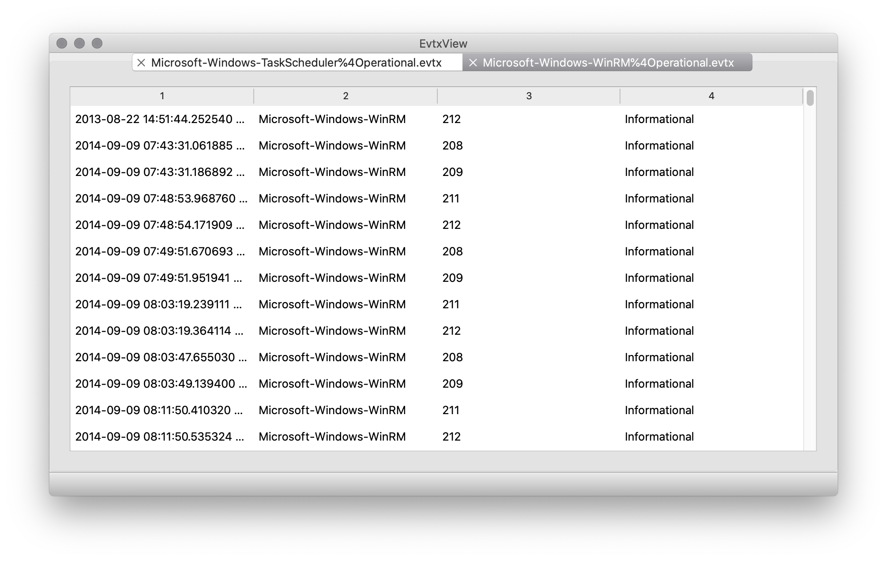

# evtxview

`evtxview` is a GUI viewer for Microsoft Windows evtx files (Windows event logs). I'm hacking this tiny tool because I need such a tool in most forensic investigations.

## Screenshots



## Installation

```shell
# create a virtual environment
python3 -m venv venv

# activate virtual environment
source venv/bin/activate

# install required packages
pip3 install -r requirements.txt
```

## Usage

As this is a GUI-only tool, usage is simple:
```shell
# load virtual environment, unless you did that already
source venv/bin/activate

# start evtxview
python3 evtxview.py
```

That's it ;-)

## Features

- You can open as many `evtx` files as you need to

